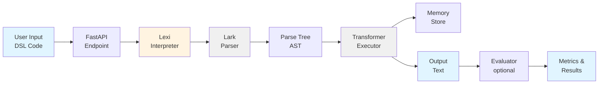

# 🧩 TinyDSL

[](LICENSE)

**TinyDSL** is a modular, extensible, agent-ready python framework for exploring and testing domain-specific languages (DSLs).
It currently supports these DSLs:

* 🎨 **Gli** — graphics DSL for procedural image generation
* 🗣️ **Lexi** — text DSL for structured, expressive text generation and reasoning
* 🧮 **TinyCalc** — unit conversion DSL for novel units and calculations
* 🗄️ **TinySQL** — simplified query DSL for data operations
* 🔢 **TinyMath** — general-purpose arithmetic calculator with variables and functions

All DSLs are served via a unified **FastAPI backend** and are designed to be invoked by **LLM agents** or external REST clients.

---

## ⚙️ Get Started

Use [uv](https://github.com/astral-sh/uv):

```bash
uv venv
uv add tinydsl
python -m tinydsl.api.main
```

Or pip

```bash
python -m venv .venv
source .venv/bin/activate
pip install tinydsl
python -m tinydsl.api.main
```

Open [http://localhost:8008/docs](http://localhost:8008/docs).


### Local Dev

```bash
git clone https://github.com/deepsaia/tinydsl.git
uv venv
uv sync
python -m tinydsl.api.main
```

---

## 🏗️ Architecture

### Data Flow (Example: Lexi DSL)



**Flow Explanation:**
1. **User Input** → DSL code string (e.g., `say "Hello!"`)
2. **FastAPI Endpoint** → Routes request to appropriate DSL handler
3. **Interpreter** → Coordinates parsing and execution
4. **Lark Parser** → Tokenizes and parses code using grammar
5. **Parse Tree** → Abstract Syntax Tree (AST) representation
6. **Transformer** → Walks AST, executes operations
7. **Memory Store** → Persistent state (for `remember`/`recall`)
8. **Output** → Final result (text, image path, data)
9. **Evaluator** → Optional validation against expected results
10. **Metrics** → Accuracy, similarity scores, benchmarks

### Project Structure

```
tinydsl/
├── core/               # Shared abstractions
│
├── parser/            # Grammar-based parsers
│
├── data/              # Grammars, examples, benchmarks
│
├── lexi/              # Text DSL implementation
│
├── gli/               # Graphics DSL implementation
│
├── tinycalc/          # Unit conversion DSL
├── tinysql/           # Query DSL
├── tinymath/          # Arithmetic calculator DSL
│
├── api/               # REST API layer
│
├── agent_tools/       # LLM agent integrations
├── rl/                # Reinforcement learning framework
└── tests/             # Comprehensive test suite
```

**Key Design Principles:**
- **Modularity**: Each DSL is self-contained with clear interfaces
- **Extensibility**: Add new DSLs by implementing `BaseDSL`
- **Testability**: Unified evaluator framework for all DSLs
- **Agent-Ready**: REST API + Python tools for LLM integration

---

## 🧠 Example Usage

### **Lexi (Text DSL)**

```dsl
set mood happy
say "Hello!"
repeat 2 { say "Have a wonderful day!" }
```

Lexi supports persistent memory:

```dsl
remember name = "John Arthur"
recall name
```

### **Gli (Graphics DSL)**

```dsl
set color orange
repeat 10 {
  set size 3+$i
  draw circle x=cos($i*20)*$i*10 y=sin($i*20)*$i*10
}
```

Images save to `/output` as `{id}_{name}_{YYYYMMDD_HHMMSS}.png` (when `id`/`name` provided).

### **TinyMath (Arithmetic Calculator)**

```dsl
x = 10
y = 20
x + y * 2
sqrt(144)
sin(0)
max(5, 10, 3)
```

TinyMath supports variables, arithmetic operators (`+`, `-`, `*`, `/`, `^`, `%`), comparison operators (`==`, `!=`, `<`, `>`, `<=`, `>=`), and built-in functions (trig, rounding, min/max).

**Note**: TinyMath is for general arithmetic. Use **TinyCalc** for unit conversions (flurbs, grobbles, zepts).

---

## 🚀 What's New

* **Lark everywhere**

  * `lark_lexi_parser` and `lark_gli_parser` now power both DSLs.
  * Deterministic, extensible grammars; clearer errors.

* **Pillow renderer by default (Gli)**

  * Crisp, anti-aliased output via supersampling.
  * Matplotlib still available if you want it.

* **Smarter inline math**

  * `$i` loop index, `pi`, `e` available.
  * Natural expressions like `10+$i*5` work.
  * `calc(...)` remains for explicit math.

* **AST endpoint (All DSLs)**

  * Get parse trees to inspect/visualize your programs.
  * Unified Lark-based AST parsing across all DSLs.

* **Stable filenames**

  * Artifacts saved as `{id}_{name}_{timestamp}.png` when `id` and/or `name` provided.

---

## 📚 API Overview

### Core Endpoints (All DSLs)

All DSLs support these consistent endpoints:

| Endpoint   | Method | Purpose                              |
| ---------- | ------ | ------------------------------------ |
| `/run`     | POST   | Execute DSL code                     |
| `/task`    | POST   | Run a predefined benchmark task      |
| `/eval`    | POST   | Evaluate multiple outputs            |
| `/ast`     | POST   | Get AST (raw dict / pretty / DOT)    |

### DSL-Specific Endpoints

**Lexi** (additional endpoints):

| Endpoint           | Method | Purpose                           |
| ------------------ | ------ | --------------------------------- |
| `/memory`          | GET    | View persistent memory            |
| `/memory/clear`    | POST   | Clear memory                      |
| `/memory/set`      | POST   | Set key-value in memory           |

### Examples & Discovery

All DSLs also provide:

| Endpoint    | Method | Purpose                      |
| ----------- | ------ | ---------------------------- |
| `/examples` | GET    | List available examples/tasks |

---

## 🔧 Quick Calls

### Run DSL Code

```bash
# Lexi
curl -X POST http://localhost:8008/api/lexi/run \
  -H 'Content-Type: application/json' \
  -d '{"code":"set mood happy\nsay \"Hello!\""}'

# Gli
curl -X POST http://localhost:8008/api/gli/run \
  -H 'Content-Type: application/json' \
  -d '{"code":"set color blue\nset size 10\ndraw circle x=50 y=50","save":true}'

# TinyCalc
curl -X POST http://localhost:8008/api/tinycalc/run \
  -H 'Content-Type: application/json' \
  -d '{"code":"define 1 flurb = 3 grobble\nconvert 10 flurb to grobble"}'

# TinySQL
curl -X POST http://localhost:8008/api/tinysql/run \
  -H 'Content-Type: application/json' \
  -d '{"code":"load table users from \"data.json\"\nselect name, age"}'

# TinyMath
curl -X POST http://localhost:8008/api/tinymath/run \
  -H 'Content-Type: application/json' \
  -d '{"code":"x = 10\ny = 20\nx + y * 2\nsqrt(144)"}'
```

### Run Benchmark Tasks

```bash
# Lexi task
curl -X POST http://localhost:8008/api/lexi/task \
  -H 'Content-Type: application/json' \
  -d '{"task_id":"lexi_001"}'

# Gli task
curl -X POST http://localhost:8008/api/gli/task?task_id=gli_001

# TinyCalc task
curl -X POST http://localhost:8008/api/tinycalc/task \
  -H 'Content-Type: application/json' \
  -d '{"task_id":"tinycalc_001"}'

# TinyMath task
curl -X POST http://localhost:8008/api/tinymath/task \
  -H 'Content-Type: application/json' \
  -d '{"task_id":"001"}'
```

### Evaluate Outputs

```bash
# Evaluate multiple task results
curl -X POST http://localhost:8008/api/lexi/eval \
  -H 'Content-Type: application/json' \
  -d '{"results":[{"task_id":"lexi_001","output":"Hello!"},{"task_id":"lexi_002","output":"Goodbye!"}]}'
```

### Get AST (Parse Tree)

```bash
# Get AST for any DSL
curl -X POST http://localhost:8008/api/tinycalc/ast \
  -H 'Content-Type: application/json' \
  -d '{"code":"define 1 flurb = 3 grobble","include_pretty":true,"include_dot":false}'

curl -X POST http://localhost:8008/api/lexi/ast \
  -H 'Content-Type: application/json' \
  -d '{"code":"say \"Hello world!\"","include_pretty":true}'
```

---

## 🤖 Agent Integration

```python
from tinydsl.agent_tools.tinydsl_tool import TinyDSLTool

tool = TinyDSLTool(base_url="http://localhost:8008/api")
print(tool.run_lexi('say "Hello there!"')["output"])
print(tool.run_lexi_task("005"))
print(tool.get_memory()); tool.clear_memory()
```

---

## 🧪 Testing

TinyDSL has a comprehensive test suite with 148 tests divided into unit and integration tests.

### Run All Tests

```bash
# Run all tests (unit + integration)
pytest tests/ -v

# Run with coverage
pytest tests/ --cov=src/tinydsl --cov-report=html
```

### Run Unit Tests Only (Fast)

```bash
# Exclude integration tests that require a running server
pytest tests/ -v -m "not integration and not requires_server"
```

### Run Integration Tests Only

```bash
# Start the API server first
python -m tinydsl.api.main

# In another terminal, run integration tests
pytest tests/ -v -m "integration or requires_server"
```

### Test Categories

- **Unit tests**: Fast, no server required
  - Core framework (DSL registry, memory, evaluator)
  - DSL interpreters (TinyCalc, TinyMath, TinySQL, Lexi, Gli)
  - RL environment and agents
  - Parsers and evaluators

- **Integration tests**: Require running API server
  - `TestTinyDSLToolIntegration` - API client tools
  - `TestGenericDSLClientIntegration` - Generic DSL client
  - `TestRLEnvironmentIntegration` - RL with live API
  - `TestRLTrainerIntegration` - RL training workflows

### CI/CD

GitHub Actions automatically runs unit tests on every push/PR. Integration tests are skipped in CI.

---

## 📦 Data & Files

* Examples & grammars live under `src/tinydsl/data/`

  * `gli_examples.json`, `gli_grammar.lark`
  * `lexi_tasks.json`, `lexi_grammar.lark`
* Outputs: `./output/` (images, `lexi_memory.json`)

You can override data paths with env vars:
`GLI_EXAMPLES_PATH`, `GLI_GRAMMAR_PATH`, `LEXI_TASKS_PATH`, `LEXI_GRAMMAR_PATH`.

---

## 🧩 Extend

Add a new DSL by creating:

1. **Grammar**: Define syntax in `data/<dsl>_grammar.lark`
2. **Parser**: Implement transformer in `parser/lark_<dsl>_parser.py`
3. **Interpreter**: Extend `BaseDSL` in `<dsl>/<dsl>.py`
4. **Evaluator**: Create evaluator in `<dsl>/<dsl>_evaluator.py`
5. **API Routes**: Add endpoints in `api/routes_<dsl>.py`
6. **Data**: Add examples and tasks in `data/`
7. **Tests**: Add test suite in `tests/test_<dsl>.py`

Register routes in `api/main.py`.

**All DSLs share:**
- Unified evaluation framework (`BaseEvaluator`)
- Common testing infrastructure
- Plugin architecture (`DSLRegistry`)
- REST API patterns

TinyDSL's modular design makes it easy to study **continual learning, compositional reasoning, and symbolic generalization** across DSLs.

---

## 🪪 License

Licensed under the **Apache License, Version 2.0**.  
See [LICENSE](LICENSE) for details.

---
